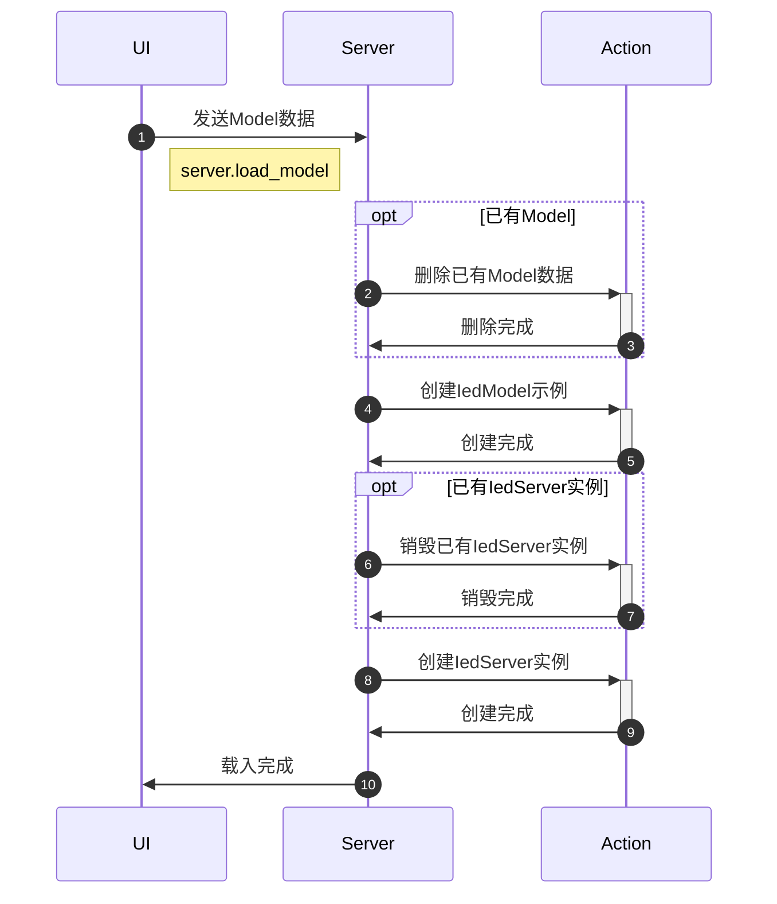
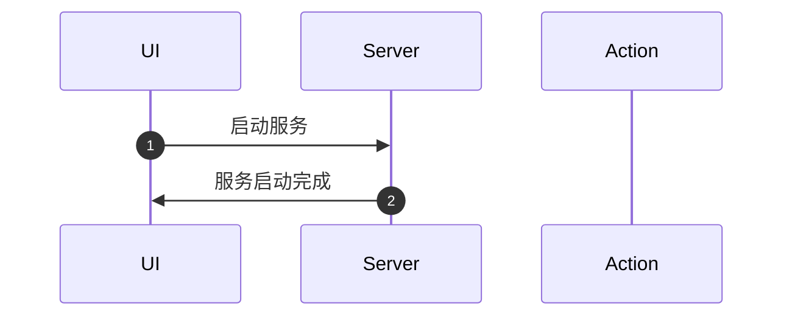
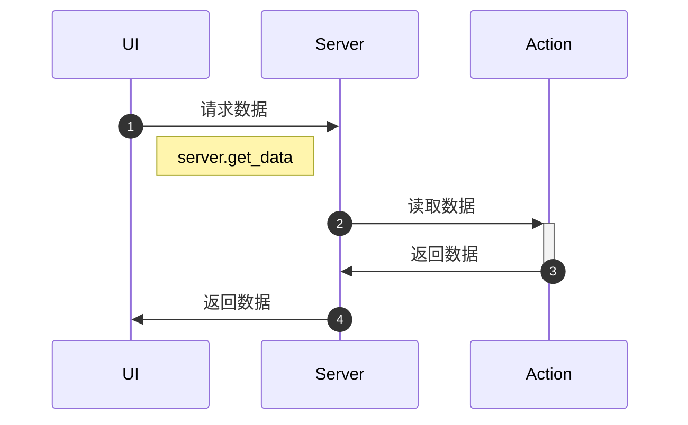
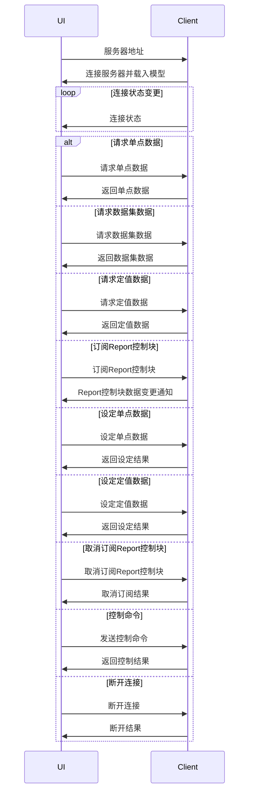

# 服务端

## 基础流程

### 载入模型 server.load_model

测试用例:
ActionServer.
  StartMissingPayloadReturnsError
  LoadModelMissingPayloadReturnsError
  SetDataValueInvalidRequestReturnsError
  GetValuesInvalidRequestReturnsError
  GetClientsReturnsPayload
  LoadModelAndStartServerReturnsSuccess

- 载入一个Model数据，验证载入完成
  * `ActionServerModelTest.LoadDefaultModelReturnsSuccess`
  * `ActionServerModelTest.LoadReportModelReturnsSuccess`
  * `ActionServerModelTest.LoadControlModelReturnsSuccess`
  * `ActionServerModelTest.LoadSettingGroupModelReturnsSuccess`
- 载入一个Model数据后再载入另一个Model数据，验证旧数据被删除且新数据载入完成
  * `ActionServerModelTest.ReloadModelReplacesExistingModel`

### 启动服务 server.start
前置条件: 模型已加载

测试用例:
- 启动服务后验证服务启动完成
  * `ActionServer.StartServerReturnsSuccess`

### 读取数据

测试用例:
- 未加载模型时请求数据，验证返回错误
  * `ActionServerOperationTest.GetValuesInvalidRequestReturnsError`
- 请求的Reference不存在，验证返回错误
  * `ActionServerOperationTest.GetValuesNonExistentReferenceReturnsError`
- 请求数据，验证返回正确数据
  * `ActionServerOperationTest.GetValuesValidReferenceReturnsValue`

## 数据变更联动

# 客户端

## 基础流程

